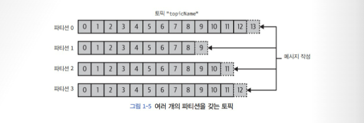

# 추천사 & 시작하며
카프카 : 스트리밍 플랫폼으로 정의

MQ 메시징 시스템이라 생각하기 쉬우나 차이점이 여럿 있음
1. 현대적인 분산 시스템 : 일반적인 하드웨이 위에서 분산 클라스터 형태로 작동, 신축성있게 확장 가능
2. 원하는 만큼 오랫동안 데이터를 저장할 수 있음
3. 높은 추상화 수준

# Chapter 1. 카프카 시작하기
## 1.1 발행/구독 메시지 전달
> 과학자들이 서로 동의하지 않는 상황이 벌어진다면, 그것은 데이터가 불충분하기 때문이다. 그리고 어떠한 데이터를 얻을 것인지를 합의하고 데이터를 얻을 수 있다면 문제는 해결된다. 내가 옳든 상대방이 옳든, 아니면 둘 다 틀리든 말이다. 그제서야 우리는 그 다음으로 진행해 갈 수 있다

초기의 발행/구독 시스템은 직접 연결되어서 확장성이 부족해서 애플리케이션이 늘어감에 따라 복잡한 의존 관계가 생김
-> 기술 부채가 발생

개별 메시지 큐 시스템을 도입함으로 의존 관계에서는 벗어났으나, 필요에 따라 큐가 증가하게 되고 이는 유지 관리의 어려움과 중복을 발생시킴
-> 메시지큐의 중앙 관리의 필요성이 대두

## 1.2 카프카 입문
- 용어 정리
1. **메시지** : 메타 데이터 중 키를 기준으로 파티션을 구분해서 저장
2. **배치** : 메시지 저장 단위 - 같은 토픽의 파티션에 쓰여지는 메시지들의 집합(?)
3. **스키마** : 내용을 이해하기 쉽도록 만든 일정한 구조

4. **토픽** : 메시지가 분류되는 단위 - DB 테이블이 예시
5. **파티션** : 토픽은 여러 파티션으로 나뉨 
   - 프로듀서, 컨슈머, 컨슈머 그룹 등이 있음, 컨슈머에서 파티션으로의 대응 관계를 파티션 소유권이라 부름
6. 브로커 : 하나의 카프카 서버
7. 클러스터 : 브로커의 집합 
8. 파티션 리더 : 클러스터 내에서 클러스터 컨트롤러의 역할을 하는 브로커 
9. 팔로워 : 복제된 파티션을 할당받은 브로커. 복제된 파티션은 여러 브로커가 할당 받을 수 있음 
   - 왜 같은 파티션을 다른 브로커에 복제함? 리더 브로커에 장애가 발생했을 때 팔로워가 리더 브로커를 이어받기 위함

## 1.3 왜 카프카인가?
다중 프로듀서, 다중 컨슈머, 디스크 기반 보존, 확장성, 고성능, 플랫폼 기능

## 1.4 데이터 생태계
모든 클라이언트에 대해 일관된 인터페이스를 제공하면서 다양한 인프라스트럭쳐 요소들 사이에 메시지를 전달
이용사례 : 활동 추적, 메시지 교환, 지표 및 로그 수집, 커밋 로그 , 스트림 처리

## 1.5 카프카의 기원
링크드인이 확장됨에 따라 커스텀하게 필요한 기능은 많고, 고가용성이 필수적인데 핏한 오픈소스나 MQ 제품이 없어서, 커스텀 인프라스터럭처가 필요하게 됨