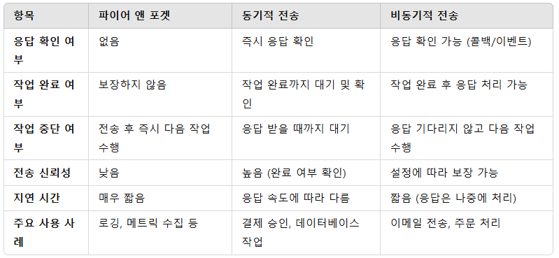
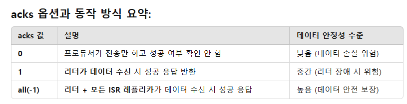
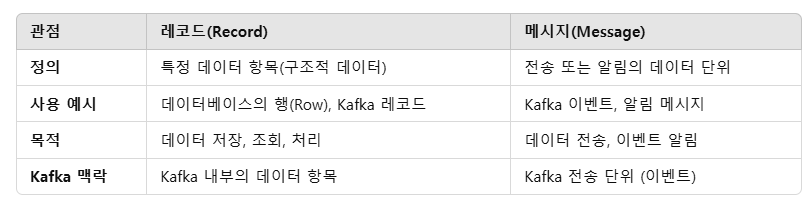

# 카프카 프로듀서 : 카프카에 메시지 쓰기
카프카를 이용하려면 프로듀서나 컨슈머 혹은 두 기능을 모두 수행하는 애플리케이션을 생성해야한다.

## 애플리케이션이 카프카에 메시지를 써야하는 상황
1. 감사 혹은 분석을 목적으로 한 사용자 행동 기록
2. 성능 메트릭 기록
3. 로그 메시지 저장
4. 스마트 가전에서의 정보 수집
5. 다른 애플리케이션과의 비동기적 통신 수행
6. 임의의 정보를 데이터베이스에 저장하기 전 버퍼링

등등

## 목적에 따른 요구 조건
1. 모든 메시지가 중요해서 메시지 유실이 용납되지 않는지
2. 유실이 허용되는지
3. 중복이 허용되는지
4. 반드시 지켜야할 지연이나  처리율이 있는지

등등

## 프로듀서의 메시지 전송 방법 3가지
### 1. 파이어 앤 포겟
전송만 하고 성공 혹은 실패 여부 신경 x, 응답이 불필요하고 실패 여부 확인 불가
### 2. 동기적 전송
작업이 완료할 때 까지 기다렸다가 실제 성공 여부 확인 후 전송
### 3. 비동기적 전송
메시지를 전송하고 응답을 기다리지 않지만, 나중에 결과(성공 또는 실패)를 처리할 수 있도록 콜백 또는 이벤트 수신을 설정.





## 시리얼라이저
> 시리얼라이저(Serializer)는 Kafka 프로듀서(Producer)가 데이터를 바이트 배열(byte array)로 변환하는 데 사용하는 변환기(Converter). 
> Kafka는 바이트 배열(byte[])만 네트워크를 통해 가능. 따라서, 프로듀서가 메시지를 보낼 때 키(key)와 값(value)을 바이트 배열로 변환하는 역할

카프카로 전송해야하는 객체가 단순 문자열이나 정숫값이 아닐 경우 시리얼라이저가 필요한데, 
커스텀으로 만들었을 경우 레코드가 변경에 취약해진다. 
그리고 시리얼라이즈된 데이터는 바이터 행렬이기 때문에 디버깅이 굉장히 어렵다. 

그래서 커스텀한 시리얼라이저보다 범용 라이브러리의 사용을 권장하고, 이 책에선 에이브로를 소개함

```json
{
  "type": "record",
  "name": "User",
  "fields": [
    {"name": "id", "type": "int"},
    {"name": "name", "type": "string"},
    {"name": "email", "type": ["null", "string"], "default": null}
  ]
}
```
에이브로의 레코드 관리 방식, 스키마가 필요하지만 이진 포맷으로 변환되므로 데이터 크기가 작아지고 전송 속도가 빨라짐
데이터는 byte 어레이 형태로 전송된다.

### 자바에는 `Serializable interface`가 있지 않나?
`implements Serializable`만 붙여서 쉽게 사용가능하지만, 다른 언어와 호환되지 않음. 
무엇보다 데이터 크기가 크고 이진 포맷이 아니다.



- 레코드(Record): 데이터를 저장, 조회, 관리하는 항목. (주로 저장 관점)
- 메시지(Message): 전송, 알림, 이벤트 발생 단위. (주로 전송 관점)

## 파티션
### 접착성 문제 
키가 없는 레코드는 라운드로빈 방식으로 파티션에 분배되어, 각기 다른 파티션에 메시지가 분산됨, 접착성 문제는 같은 종류의 메시지들이 다른 파티션에 분배되어, 데이터의 순서나 그룹화가 어려워지는 문제가 발생하기 때문에 키 기반 파티셔닝을 사용하거나, 수동 파티션 지정을 통해 파티션을 일관되게 유지해야 한다.

### 접착성 문제가 발생할 경우 생기는 문제
1. 순서 보장 문제 : 카프카에서 파티션은 독립적으로 메시지를 처리하므로, 같은 파티션 내에서 메시지의 순서는 보장됨. 그러나 메시지 그룹이 다양한 파티션에 분배되면, 각 파티션은 독립적으로 메시지를 처리하기 때문에 메시지의 순서가 보장되지 않음.
2. 메시지 그룹화 및 세션 유지 문제 : 메시지 그룹화는 특정 키를 기준으로 메시지를 같은 파티션에 보내는 방식인데, 메시지 그룹이 여러 파티션에 분배되면 세션 정보나 그룹 정보가 파티션을 넘어서서 일관되지 않게됨. 이는 특히 클라이언트 상태나 세션 관리가 중요한 경우에 문제가 됨.
3. 처리 일관성 문제 : 메시지 그룹이 여러 파티션에 나누어져 저장되면, 이 메시지들을 처리하는 소비자가 메시지의 일관성을 보장하기 어려워질 수 있음. 특히 상태를 추적해야 하는 경우, 여러 파티션에서 데이터를 동시에 처리하면서 상태 불일치가 발생할 수 있음.

## 헤더
추가 메타데이터 전달
## 인터셉터
카프카 클라이언트 코드를 고치지 ㅇ낳으면서, 동작 변경이 필요할 때. 모든 애플리케이션에 동일한 동작을 집어넣어야할 때 사용
### 쿼터, 스로틀링
쓰기/읽기 속도 제한